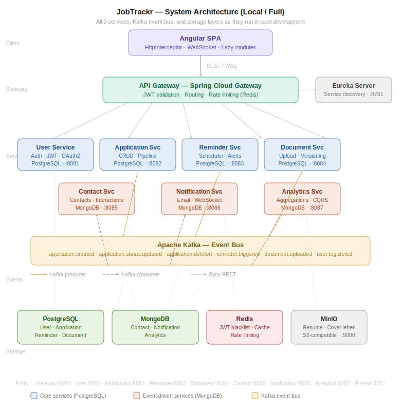
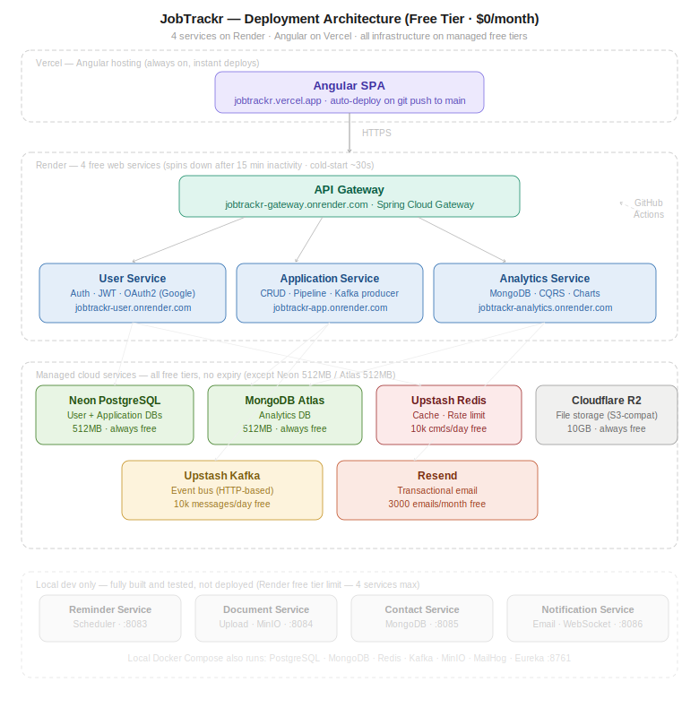
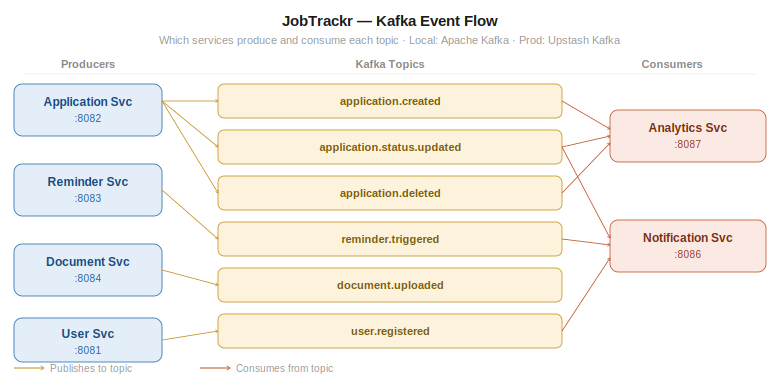

# 🎯 JobTrackr — Job Application Tracker

> A full-stack, microservices-based application to track your job hunt from first click to signed offer.

---

## 🔭 Project Vision

Job hunting is chaotic. You're applying to dozens of companies, juggling interviews, chasing follow-ups, uploading different resume versions, and trying to remember who you spoke to at which company. Spreadsheets break down. Memory fails. Opportunities slip through the cracks.

**JobTrackr** is a personal command center for your job search. It brings structure to the chaos — letting you track every application through its full lifecycle, get reminded of follow-ups, store your documents, log contacts, and see patterns in your search through rich analytics.

Built as a **microservices system** using **Angular + Spring Boot**, this project is designed to be as much a learning platform as it is a useful product. Every architectural decision is intentional — from Kafka event streams to MongoDB aggregation pipelines — making it a comprehensive hands-on project for a junior full-stack developer growing into mid-level.

---

## 🎯 Goals

- **Practical** — Solve a real problem you face right now while job hunting
- **Educational** — Touch every layer of a modern production stack
- **Portfolio-worthy** — Demonstrates distributed systems thinking, not just CRUD
- **Incrementally buildable** — Each phase is independently shippable

---

## 🧱 Tech Stack

| Layer | Local Dev | Production (Free) |
|---|---|---|
| Frontend | Angular 21 dev server | **Vercel** |
| Backend Services | Spring Boot 3.x (Docker) | **Render** (free web services) |
| API Gateway | Spring Cloud Gateway | Render |
| Service Discovery | Netflix Eureka | Disabled in prod — Gateway routes via hardcoded Render URLs |
| Message Broker | Apache Kafka (Docker) | **Upstash Kafka** (free tier) |
| Relational DB | PostgreSQL (Docker) | **Neon** (free tier, 512MB) |
| Document DB | MongoDB (Docker) | **MongoDB Atlas** (free tier, 512MB) |
| Cache | Redis (Docker) | **Upstash Redis** (free tier) |
| File Storage | MinIO (Docker) | **Cloudflare R2** (free 10GB) |
| Inter-service HTTP | OpenFeign | OpenFeign |
| Auth | JWT + Spring Security + OAuth2 (Google) | Same |
| Containerization | Docker + Docker Compose | Docker (Render builds from Dockerfile) |
| Email | MailHog (local SMTP UI) | **Resend** (free 3000/month) |
| CI/CD | — | **GitHub Actions** — builds, pushes to Docker Hub, triggers Render deploy hooks per service |

> Backend stack: Spring Boot 4.0.6 · Spring Cloud 2025.1.1 · Java 21

---

## 🗂️ Services Overview

| Service | Port | Description |
|---|---|---|
| API Gateway | 8080 | Single entry point, routing, JWT validation |
| User Service | 8081 | Auth, registration, profile |
| Application Service | 8082 | Core job application CRUD + pipeline |
| Reminder Service | 8083 | Deadlines, follow-ups, interview alerts |
| Document Service | 8084 | Resume/cover letter uploads + versioning |
| Contact Service | 8085 | Recruiter contacts per application |
| Notification Service | 8086 | Email + in-app alerts via Kafka |
| Analytics Service | 8087 | Stats, trends, funnel charts |
| Eureka Server | 8761 | Service registry |

---

## 🚀 Getting Started (Local Dev)

```bash
# Clone the repo
git clone https://github.com/tkrsatyam/jobtrackr.git
cd jobtrackr

# Start all infrastructure + services
docker compose up -d

# Frontend
cd frontend/jobtrackr-fe
npm install
ng serve
```

Frontend runs at `http://localhost:4200`
API Gateway at `http://localhost:8080`
Eureka Dashboard at `http://localhost:8761`

---

## 📁 Repository Structure

```
jobtrackr/
├── README.md
├── docker-compose.yml
├── scripts/
│   └── init-db/
│       └── 01-init.sql
├── services/
│   ├── eureka-server/
│   ├── api-gateway/
│   ├── user-service/
│   ├── application-service/
│   ├── reminder-service/
│   ├── document-service/
│   ├── contact-service/
│   ├── notification-service/
│   └── analytics-service/
├── frontend/
│   └── jobtrackr-fe/
└── docs/
    ├── FEATURES.md
    ├── API_CONTRACTS.md
    ├── DB_SCHEMA.md
    ├── HLD.md
    ├── DEPLOYMENT.md
    ├── JIRA_GITHUB.md
    └── diagrams/
        ├── system-architecture.svg
        ├── deployment-architecture.svg
        └── kafka-event-flow.svg
```

---

## 📄 Documentation Index

- [Feature List](./docs/FEATURES.md)
- [API Contracts](./docs/API_CONTRACTS.md)
- [Database Schema](./docs/DB_SCHEMA.md)
- [High Level Design](./docs/HLD.md)
- [Deployment Guide](./docs/DEPLOYMENT.md)
- [JIRA + GitHub Integration](./docs/JIRA_GITHUB.md) — branch/commit/PR naming conventions, Smart Commits, and troubleshooting when development info isn't showing up in JIRA
- [System Architecture](./docs/diagrams/system-architecture.svg) — all 9 services, Kafka bus, and storage layers
- [Deployment Architecture](./docs/diagrams/deployment-architecture.svg) — free-tier deployment across Vercel, Render, and managed services
- [Kafka Event Flow](./docs/diagrams/kafka-event-flow.svg) — producers, topics, and consumers

---

## 🗺️ Architecture Diagrams

### System Architecture


### Deployment Architecture


### Kafka Event Flow


---
 
## 🏗️ Build Phases

| Phase | Focus | Status |
|---|---|---|
| 1 | Foundation — Gateway, User, Application services + Angular shell | ✅ Complete |
| 2 | Core Features — Document, Contact, Reminder services | ⬜ Not started |
| 3 | Event-Driven — Kafka + Notification service | ⬜ Not started |
| 4 | Intelligence — Analytics service + MongoDB aggregations + Charts | ⬜ Not started |
| 5 | Polish — OAuth2, real-time notifications, deployment | ⬜ Not started |

---

## 🚀 Deployment (Free Tier)

This project is deployed at zero cost using free tiers across multiple platforms. See [DEPLOYMENT.md](./docs/DEPLOYMENT.md) for the full guide.

**What is deployed vs local-only:**

| Service | Deployed | Reason |
|---|---|---|
| API Gateway | ✅ Render | Entry point — must be live |
| User Service | ✅ Render | Auth — must be live |
| Application Service | ✅ Render | Core feature — must be live |
| Reminder, Document, Contact, Notification, Analytics | 🖥️ Local only | Not built yet (Phase 2+) or pending Render's free tier slot |

> Phase 1 services — Eureka, Gateway, User Service, Application Service — are fully built and run locally via Docker Compose. Gateway, User Service, and Application Service are also deployed live on Render. Reminder, Document, Contact, Notification, and Analytics don't exist yet (Phase 2–4); deployment will expand as they're built, scoped to stay within Render's free tier (4 web services max).

> Render free services sleep after 15 min of inactivity. A GitHub Actions workflow pings all three services every 10 minutes on weekdays, 10:30 AM–5:00 PM IST, to keep them warm during active hours — outside that window, expect a cold start (~2–3 minutes) on the first request.

**Live URLs:**
- Frontend: `https://jobtrackr-portal.vercel.app`
- API: `https://jobtrackr-gateway.onrender.com`
